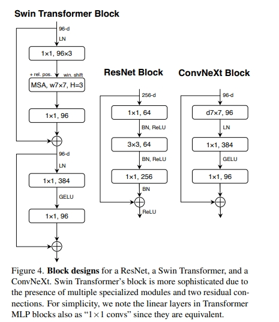
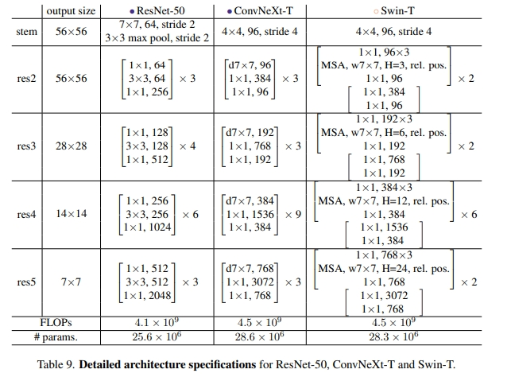

# ConvNext_from_scratch

## Introduction

Pytorch版本实现的ConvNext (仅供学习)

## Preliminary

- **ConvNext-architecture**

## Acknowledgements

- [A ConvNet for the 2020s](https://github.com/facebookresearch/ConvNeXt?tab=readme-ov-file)

-[ConvNeXt模型代码逐行讲解](https://www.bilibili.com/video/BV11Y41137VA/?spm_id_from=333.1007.top_right_bar_window_history.content.click&vd_source=634f9cd56b5b0cf10f6976238630bd8d)